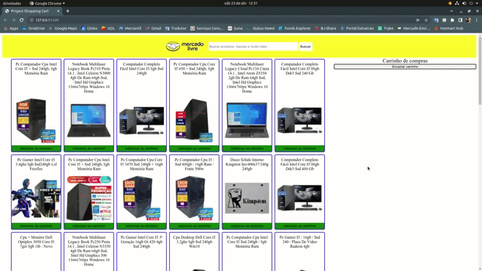

# Projeto Shopping Cart

## Contexto

Neste projeto foi implementado várias funções utilizando as Higher Order Functions do JavaScript, para conseguir filtrar e entregar os dados da melhor forma possível.

## Técnologias usadas

Projeto desenvolvido em funções assíncronas do JavaScript, CSS e HTML.

## Habilidades desenvolvidas

Neste projeto, pude desenvolver as seguintes habilidades:

- Fazer requisições a uma API *(Application Programming Interface)* do Mercado Livre;
- Utilizar os meus conhecimentos sobre JavaScript, CSS e HTML;
- Trabalhar com funções assíncronas;

## Apresentação do Projeto Finalizado

## Executando aplicação

1. Clone o repositório
  * `git clone git@github.com:LucasAccurcio/shopping-cart.git`.
  * Entre na pasta do repositório que você acabou de clonar:
    * `cd shopping-cart`

2. Ter a extensão "Live Server" do VSCode instalada.

3. Abrir o projeto no VSCode, na raiz do diretório iniciar a extensão "Live Server" do VSCode
